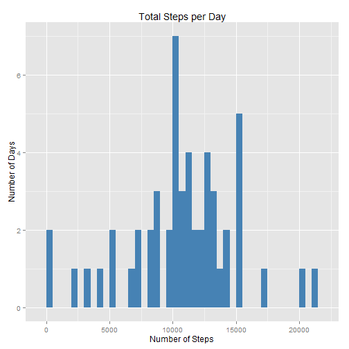
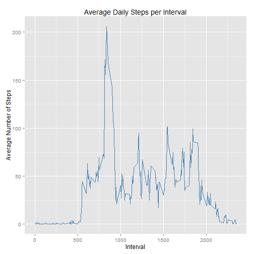
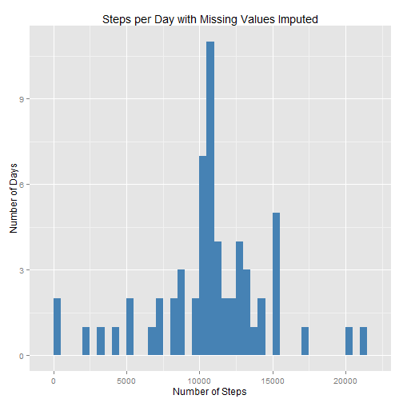
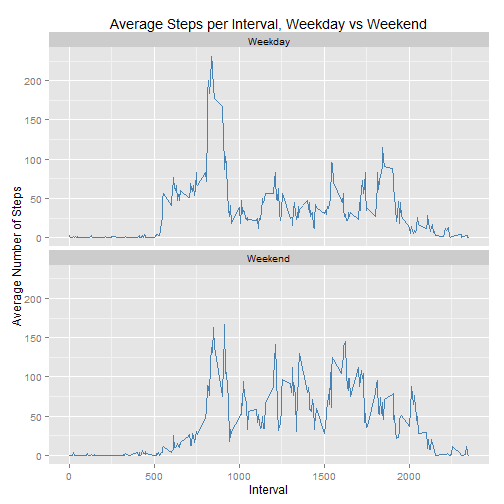

## Required libraries
This analysis uses the following libraries

```r
#Required libraries
library(plyr)
library(ggplot2)
library("scales")
library("lubridate",quietly = TRUE)
library("stringr")
library("xtable")
```

## Loading and preprocessing the data
Read in the data from the "activity.zip" file in the working directory and convert the data in the "Date"  column into date format

```r
setwd("C:/Users/Keith_2/Documents/R/RepData_PeerAssessment1")
alldata<-read.csv(unzip("activity.zip")) 
alldata$date<-as.Date(alldata$date)

options(scipen = 4) #Forces large numbers to be printed in standard form by knitR
```
Here is an example of the data:

```r
alldata[5000:5007,]
```

```
##      steps       date interval
## 5000   757 2012-10-18      835
## 5001   608 2012-10-18      840
## 5002   568 2012-10-18      845
## 5003   571 2012-10-18      850
## 5004   355 2012-10-18      855
## 5005    55 2012-10-18      900
## 5006    32 2012-10-18      905
## 5007    79 2012-10-18      910
```

Here is a summary of the data

```r
print(summary(alldata))
```

```
##      steps             date               interval     
##  Min.   :  0.00   Min.   :2012-10-01   Min.   :   0.0  
##  1st Qu.:  0.00   1st Qu.:2012-10-16   1st Qu.: 588.8  
##  Median :  0.00   Median :2012-10-31   Median :1177.5  
##  Mean   : 37.38   Mean   :2012-10-31   Mean   :1177.5  
##  3rd Qu.: 12.00   3rd Qu.:2012-11-15   3rd Qu.:1766.2  
##  Max.   :806.00   Max.   :2012-11-30   Max.   :2355.0  
##  NA's   :2304
```

```r
#calculate percentage of rows that have NA in the steps column
stepna<-round(100* sum(is.na(alldata$steps))/nrow(alldata),1)

#calculate time period over which samples were taken
dur<-max(alldata$date)-min(alldata$date) + 1
```

The data was collected over a 61 day period. 13.1% of the samples were NA.

## What is mean total number of steps taken per day?

To calculate the mean number of steps per day, first calculate total steps by day for use in the histogram and use the same result to calculate the mean and median.  The plotsteps function was created to perform these calculations and make the plot


```r
# function returns list with mean, median, a histogram of steps per day and a count of the number of days with missing data
plotsteps<-function(data,title){

#totals by day the number of steps and the numbers of samples that were NA
  stepsperday<-ddply(data, .(date),summarize, 
                     dsteps=sum(steps),
                     nasteps = sum(is.na(steps)))
  stepsperday$date<-as.Date(stepsperday$date)  
  
#calculate mean number of steps per day
  smean<-round(mean(stepsperday$dsteps,na.rm = TRUE),0)

#calculate median number of steps per day
  smedian<-round(median(stepsperday$dsteps,na.rm = TRUE),0)

#build histogram of total steps per day 
  graph<-ggplot(stepsperday,aes(dsteps)) +
              geom_histogram(fill = "steelblue", binwidth = 500) + 
              labs(list(title = title, x="Number of Steps", y ="Number of Days"))
  
#Calculate  number of days that had NA value
  nadays<-sum(stepsperday$nasteps>0)              

out  <- list(mean = smean, median = smedian,graph = graph, NAdays = nadays)
}
```

This is a histogram of total steps by day with a bin width of 500 steps.   

```r
a<-plotsteps(alldata, "Total Steps per Day")
print(a$graph)
```

 

Ignoring the 8 days where no data is available, the mean number steps taken each day is 10766 and the median is 10765

## What is the average daily activity pattern?
First calculate the average number of steps by 5 minute period

```r
avgstepsbyperiod<-ddply(alldata,.(interval),summarize,
                        avg = mean(steps,na.rm = TRUE))


 graph<-ggplot(avgstepsbyperiod,aes(interval,avg)) +
                 geom_line(colour = "steelblue") + 
                 labs(list(title = "Average Daily Steps per Interval", 
                         x     = "Interval", 
                         y     = "Average Number of Steps"))
                
 print(graph)
```

 

To calculate the interval with the most steps

```r
moststeps<-avgstepsbyperiod[avgstepsbyperiod$avg == max(avgstepsbyperiod$avg),]
```

The interval with the greatest average number of steps over the sample period is 835 with and average of 206.2 steps.  

## Imputing missing values


```r
#Calculate the number of rows with missing data
missing<-!complete.cases(alldata)
incrows<-sum(missing)
```


1. There are 2304 rows with missing from  data.  As 8*288 = 2304, we can deduce that all eight days are missing all their data.  This simplifies fixing the data.
2. Values to complete these data are imputed from the mean number of steps for that 5 minute period calculated from the rest of the dataset.  Because there are eight entire days that have no data (steps = NA for every interval), it is possible to have R automatically recycle the average steps by period data calcuated above to fill the missing values into the incomplete cases
3. Now to create a new data set with the NA values replaced with the mean value for each 5-minute period

```r
#make a copy of the original
newdata<-alldata

# put the average steps by period calculated above into the incomplete cases.  R will automatically recycle the data so that all eight days are updated
newdata[!complete.cases(newdata),"steps"]<- avgstepsbyperiod$avg

# now recalculate the number of rows with missing data
incrows<-sum(!complete.cases(newdata))
```

  Now 0 rows are missing data

4. Now use the function defined above calculate mean and median and graph the new data set

```r
b<-plotsteps(newdata, "Steps per Day with Missing Values Imputed")

print(b$graph)
```

 

The mean is now 10766 and the median is 10766.  By definition, using the 5-minute interval means to replace NAs will not change the 5-minute means and therefore the overall daily mean doesn't change because all that we have done is add eight additional days worth of data with the mean number of steps.  However we would expect the median to increase slightly by adding eight further days of data with a value greater than the median calculated with missing data. 

## Are there differences in activity patterns between weekdays and weekends?

1. Create a new factor variable identifying if day is a weekday or a weekend

```r
newdata[weekdays(newdata$date) %in% c("Saturday","Sunday"),"DoW"]<-"Weekend"
newdata[is.na(newdata$DoW),"DoW"]<-"Weekday"
newdata$DoW<-as.factor(newdata$DoW)


WvW<-ddply(newdata,.(DoW,interval),summarise,
                                    avg = mean(steps))
```

```r
graph<-ggplot(WvW,aes(interval,avg, group = DoW)) +
              geom_line(colour = "steelblue") + 
    #          scale_x_discrete(breaks=seq(0, 2400, by=100)) +
              labs(list(title = "Average Steps per Interval, Weekday vs Weekend", 
                        x     = "Interval", 
                        y     = "Average Number of Steps"))+
              facet_wrap(~DoW,nrow =2)
print(graph)
```

 

As can be seen from the above chart, there is a very clear difference in activity patterns from weekdays to weekends.  Weekends show a steadier level of activity throughout the day whereas weekdays show activity spiking in the morning and then settling to a much lower average throughout the rest of the day
